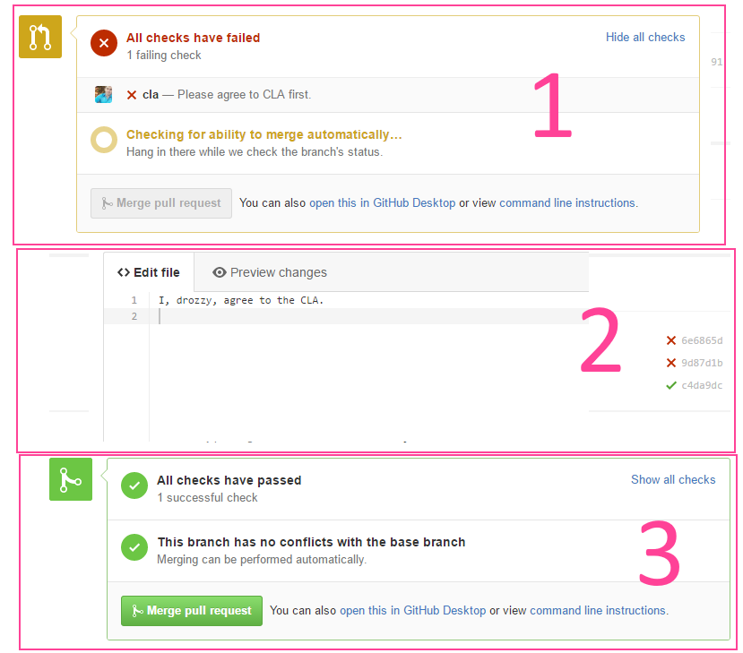
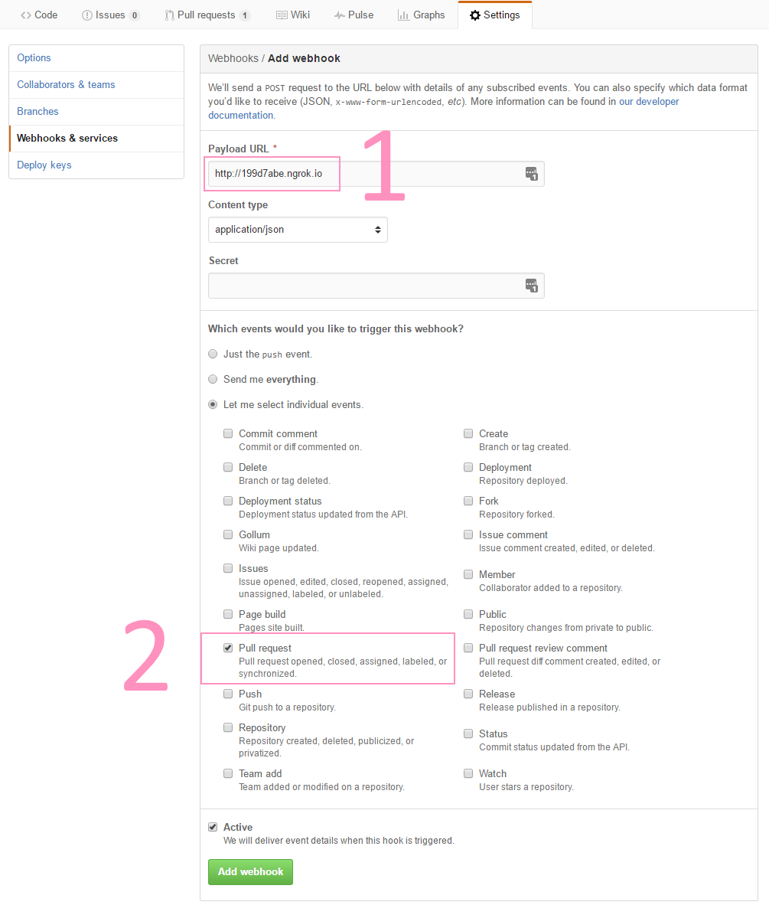
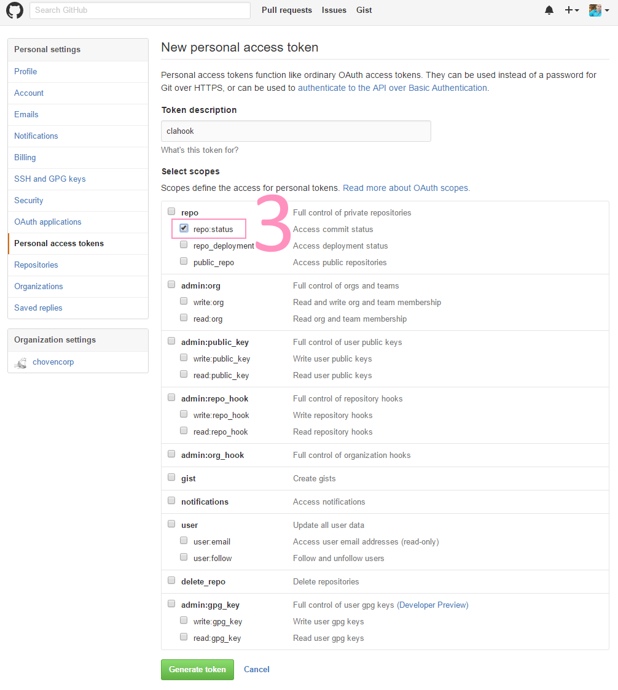

# clahook

Contributor License Agreement (CLA) webhook for github.

## Setup

1. Install the dependencies with pip: `pip install -r requirements.txt`
2. Copy `config.py.template` to `config.py`
3. Replace `{personal_access_token}` with your github personal access token (see *Github Settings* below)
4. Install dependencies: `pip -r install requirements.txt`
5. Start the server: `python clahook.py`

## Dependencies

  1. python 2.7
  2. python2 Flask
  3. python2 requests

## Algorithm

  1. Analyze payload and headers. If it is a pull request and the action is one of *opened*, 
  *reopened* or *synchronize* - go to the next step. Else stop.
  2. Check payloads and build urls.
  3. If contributors file has been removed set invalid status.
  4. If contributors file does not contain user string set invalid status.
  5. If contributors file contains user string and not removed set success status.
  6. Return response of set status post request.

## Github Settings

1. Set your `Payload URL`
2. Enable event of type `Pull request`.

3. Create new `Personal access token` with the `repo:status` scope.

## Recommended Software

* [ngrok](https://ngrok.com/) - Allows redirecting localhost:port to a public ngrok.io url.

## License

This Source Code Form is subject to the terms of the Mozilla Public
License, v. 2.0. If a copy of the MPL was not distributed with this
file, You can obtain one at http://mozilla.org/MPL/2.0/.

## Copyright

Copyright [Choven Corp](http://choven.ca) 2016. All Rights Reserved.